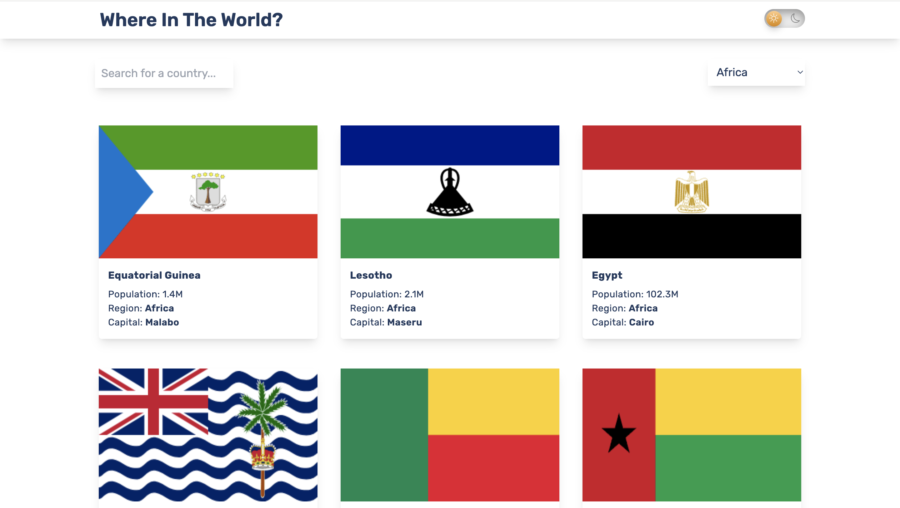

# 🌍 Countries React App

A comprehensive and interactive web application that provides detailed information about countries around the world. Built with React, this app fetches data from the REST Countries API and presents it in a beautiful, responsive interface with dark/light mode support.

## 🚀 Live Demo

**[View Live Site](https://countries-react-lemon.vercel.app/)**

## 📱 Screenshots

### Light Mode


_Homepage showing country cards in light mode_

### Dark Mode


_Homepage with elegant dark theme_

### Country Details


_Detailed view of a selected country_

## ✨ Features

### 🔍 **Search & Filter**

- **Search by Country Name**: Real-time search functionality to find countries quickly
- **Filter by Region**: Dropdown to filter countries by continent (Africa, Americas, Asia, Europe, Oceania)
- **Smart Loading**: Optimized loading states that only show when actually fetching data

### 🌙 **Dark/Light Mode**

- **Toggle Theme**: Beautiful animated toggle switch with sun/moon icons
- **Persistent Theme**: Remembers your preferred theme using localStorage
- **Consistent Styling**: Dark mode applied across all pages and components

### 📖 **Detailed Country Information**

- **Basic Info**: Population, region, subregion, capital
- **Additional Details**: Official name, top-level domain, currencies, languages
- **Visual Elements**: Country flags and coat of arms
- **Border Countries**: Clickable links to neighboring countries

### 🧭 **Navigation & UX**

- **Responsive Design**: Optimized for mobile, tablet, and desktop
- **Pagination**: Clean pagination for easy browsing
- **Loading States**: Smooth loading spinners with proper state management
- **Error Handling**: Graceful error handling with user-friendly messages

### 🔗 **Border Country Navigation**

- **Interactive Borders**: Click on border country codes to explore neighboring countries
- **Seamless Navigation**: Smooth transitions between country details

## 🛠️ Tech Stack

### Frontend

- **React 18** - Modern React with hooks and functional components
- **React Router DOM** - Client-side routing and navigation
- **SWR** - Data fetching with caching and revalidation
- **Axios** - HTTP client for API requests

### Styling

- **Tailwind CSS** - Utility-first CSS framework
- **Sass/SCSS** - Enhanced CSS with variables and mixins
- **CSS Modules** - Scoped styling for components

### UI/UX

- **React Icons** - Beautiful icon library (Bootstrap Icons)
- **React Spinners** - Loading spinners and animations
- **Millify** - Number formatting for population display

### Development Tools

- **Vite** - Fast build tool and development server
- **ESLint** - Code linting and quality assurance
- **PostCSS** - CSS processing and optimization

## 🚀 Getting Started

### Prerequisites

- Node.js (v14 or higher)
- npm or yarn package manager

### Installation

1. **Clone the repository**

   ```bash
   git clone https://github.com/yourusername/countries-react.git
   cd countries-react
   ```

2. **Install dependencies**

   ```bash
   npm install
   # or
   yarn install
   ```

3. **Start the development server**

   ```bash
   npm run dev
   # or
   yarn dev
   ```

4. **Open your browser**
   Navigate to `http://localhost:5173` to view the app

### Build for Production

```bash
npm run build
# or
yarn build
```

### Preview Production Build

```bash
npm run preview
# or
yarn preview
```

## 📁 Project Structure

```
src/
├── components/
│   ├── DarkMode/          # Dark mode toggle component
│   │   ├── DarkMode.jsx
│   │   └── DarkMode.css
│   ├── hooks/             # Custom React hooks
│   │   ├── useFetchBorders.js
│   │   ├── useFetchCountry.js
│   │   └── useFetchRegion.js
│   ├── CountryBorders.jsx # Border countries page
│   ├── CountryCard.jsx    # Individual country card
│   ├── CountryInfo.jsx    # Detailed country information
│   ├── Header.jsx         # App header component
│   ├── Inputs.jsx         # Search and filter inputs
│   ├── Layouts.jsx        # Main layout wrapper
│   ├── Page.jsx          # Main countries listing page
│   └── Pagination.jsx    # Pagination component
├── App.jsx               # Main app component
├── App.scss             # Global app styles
├── index.scss           # Global index styles
└── main.jsx            # App entry point
```

## 🔧 API Integration

This app uses the [REST Countries API](https://restcountries.com/) which provides:

- **All Countries**: `https://restcountries.com/v3.1/all`
- **Search by Name**: `https://restcountries.com/v3.1/name/{name}`
- **Filter by Region**: `https://restcountries.com/v3.1/region/{region}`
- **Country by Code**: `https://restcountries.com/v3.1/alpha/{code}`

### Custom Hooks

- **`useFetchCountry(name)`** - Fetches country data by name
- **`useFetchRegion(region)`** - Fetches countries by region
- **`useFetchBorders(code)`** - Fetches country data by border code

## 🎨 Styling Features

### Responsive Design

- Mobile-first approach
- Breakpoints for tablet and desktop
- Flexible grid layouts

### Dark Mode Implementation

- CSS custom properties for theme switching
- Animated toggle with visual feedback
- Consistent color scheme across all components

### Component Styling

- Tailwind utility classes for rapid development
- Custom SCSS for complex animations
- Shadow effects and modern design patterns

## 🚀 Performance Optimizations

### Data Fetching

- **SWR Caching**: Automatic caching and revalidation
- **Conditional Fetching**: Only fetch when parameters are valid
- **Loading State Management**: Smart loading indicators

## 🤝 Contributing

Contributions are welcome! Please feel free to submit a Pull Request.

1. Fork the project
2. Create your feature branch (`git checkout -b feature/AmazingFeature`)
3. Commit your changes (`git commit -m 'Add some AmazingFeature'`)
4. Push to the branch (`git push origin feature/AmazingFeature`)
5. Open a Pull Request

## 📝 License

This project is open source and available under the [MIT License](LICENSE).

## 👨‍💻 Author

**Onyinyechukwu Adesanya**

⭐ **If you found this project helpful, please give it a star!** ⭐
